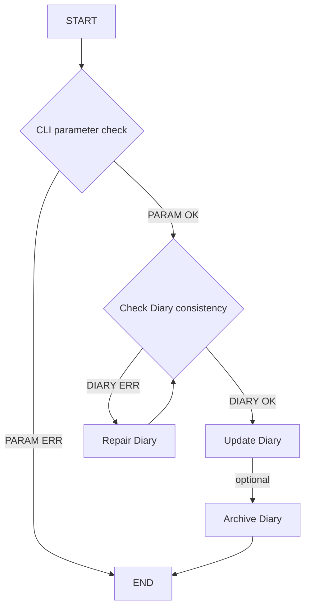
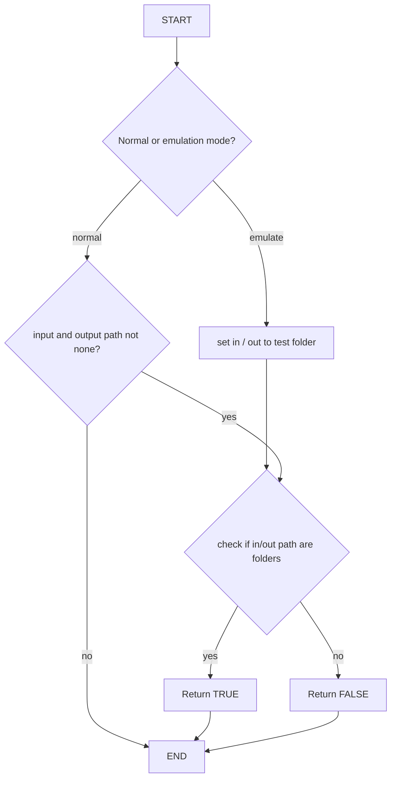
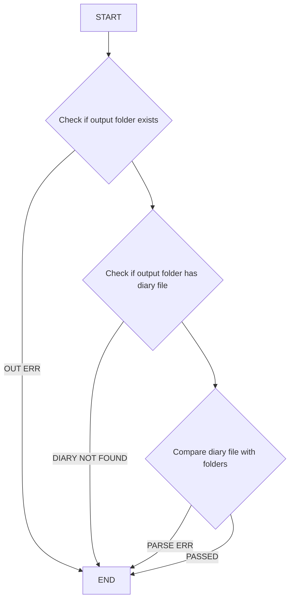
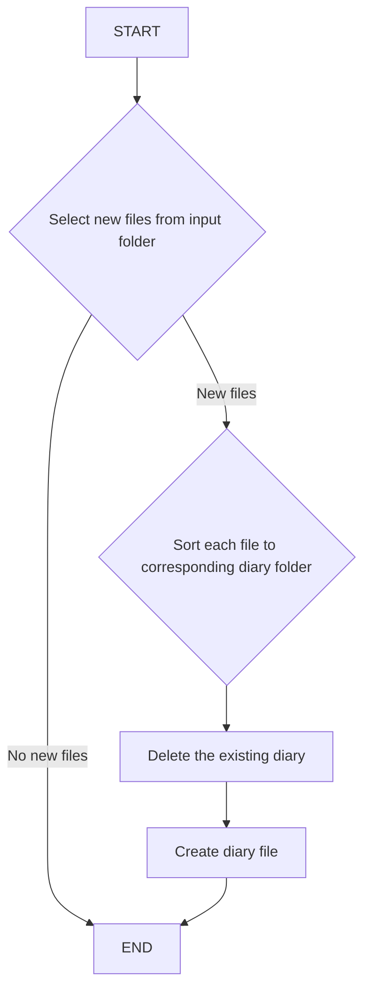
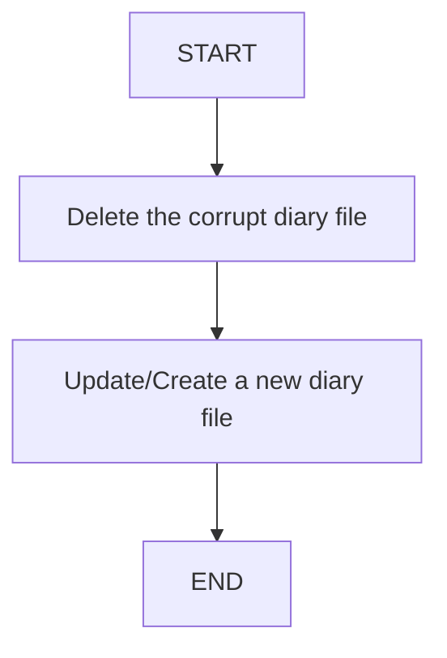

# Requirenments

## Idea
Have a file based diary. There is one root input folder, e.g. "Downloads". The destination folder is called: "Diary". In this folder all files are sorted by modification date, per day in folders:
diary
- 20230427_Thursday
- 20230428_Friday
- ...
The folder diary also includes an database/text/xml file that represents the diary file / folder structure.

When the program runs, it:
  - checks for new files in Downloads
  - it moves the new files in Diary updates the diary database file

Optional features:
  - it runs a consistency check diary database against diary folder structure, if file has been modified and modification date changed, file and entry in diary database is changed to latest modification as well
  - It archives and backups diary folders older than X days
  - archives files are marked in the database with a (A) on the root diary folder level.

# Detailed Software Requirments
- The program shall run as command line interface
- The program name shall be file_diary
- The program shall consum as parameters:
  - "-i" "input path" for input path (mandatory)
  - "-o" "output folder of diary" for the output
  - "-e" "emulate" to start the emulation of the program

## Program flow LEVEL 0

## Program flow LEVEL 1

### Check command line interface : check_cli

### Check Consistency of diary : check_diary_consist

### Update Diary : update_diary

>**Note:** Checking existing diary on changes not supported!

### Repair Diary : repair_diary

## Program flow Level 2

Level 2 of the program shall be reserved for hardware abstraction. Each time the program executes a command on the file folder level, this is abstracted by a function and can be replaced for easier testing of the functionality.

>create_diary_file(str path, str diary_name)

>delete_diary_file(str path, str diary_name)

>sort_files(str file_list, str out_folder)

>select_new_files(str input_folder)

## Failures and special cases to consider
- Someone change a file after it is sorted in the diary and with that the modification date is changed and it fits no longer in the right date folder. Solution: Write a diary check for modifications function that parses the complete diary and compares all entries in the diary file with the corresponding file structure.
- Someone rename a file, same as above.
- Someone deletes a file, same as above.
- Someone changes the diary date folder name / deletes the a diary date folder. Solution: a missing diary date folder and its content shall be marked in the diary file with a (d). This entry and its shild entries need to stay and shall not be deleted.
- 

